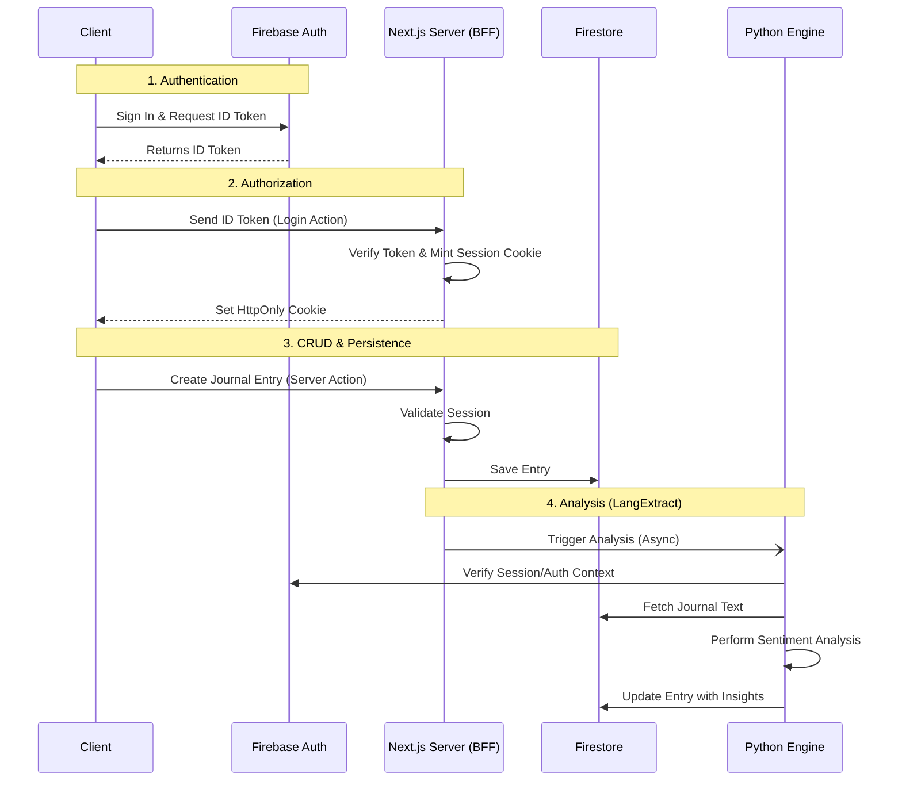

# Burnout Journaling Assistant

## Project Architecture

This project is built as a **Privacy-First Orchestrator**, utilizing Next.js as a Backend-for-Frontend (BFF) to handle user interactions and basic data persistence, while delegating complex sentiment analysis to a dedicated Python engine.

### Core Components

1.  **Next.js App (The BFF)**:
    - Acts as the secure gatekeeper between the Client and the Backend services.
    - Handles Authentication (Session Minting) and Authorization.
    - Manages basic CRUD operations (Create, Read, Update, Delete) for journals and user profiles directly via Server Actions.
    - Communicates internally with the Python Engine for analysis tasks.
    - Mints short-lived Gemini Live ephemeral tokens so the browser can open live sessions without exposing long-lived API keys.

2.  **Python Engine (`@modules/engine`)**:
    - A specialized FastAPI service isolated from direct client access.
    - Performs heavy-lifting tasks like Sentiment Analysis using **LangExtract**.
    - Interacts with the shared Firestore database to enrich journal entries with insights.
    - Secured via Firebase Session validation (passed from the Next.js server).

3.  **Firebase**:
    - **Authentication**: Handles identity verification.
    - **Firestore**: Centralized NoSQL database for syncing data between the Next.js BFF and the Python Engine.

### System Workflow

The following diagram illustrates the secure data flow between the Client, Next.js Server, and the Python Analysis Engine.



## Project Structure

The codebase is organized to separate frontend concerns from backend intelligence.

```text
/
├── app/                        # Next.js App Router (The Orchestrator)
│   ├── actions/                # Server Actions (Backend logic running on Next.js server)
│   ├── app/                    # App pages (Dashboard, Journal, etc.)
│   └── ...
│
├── components/                 # React UI Components
│   ├── auth/                   # Authentication forms (Sign in/up)
│   ├── ui/                     # Reusable UI elements (Buttons, Cards, etc.)
│   └── ...
│
├── configs/                    # Shared configurations
│   └── firebase.ts             # Environment-aware Firebase config
│
├── lib/                        # Shared Libraries & SDKs
│   ├── firebase.ts             # Client-side Firebase SDK
│   └── firebase-admin.ts       # Server-side Firebase Admin SDK
│
└── modules/
    └── engine/                 # Python Intelligence Engine
        ├── controllers/        # Business logic for analysis
        ├── models/             # Pydantic data models
        ├── routers/            # FastAPI endpoints
        └── main.py             # Application entry point
```

## Getting Started

1.  **Clone the repository**

    ```sh
    git clone https://github.com/JackieLi565/burnout-journaling-assistant.git
    ```

2.  **Setup Environment Variables**

    ```sh
    cp .env.example .env.development
    # Ensure you configure your Firebase credentials within .env.development
    ```

3.  **Start the Firebase Local Emulator**
    (Required for local backend development)

    ```sh
    npm run emulators
    ```

4.  **Start the Next.js Development Server**

    ```sh
    npm run dev
    ```

5.  **Start the Python Engine (Optional for basic CRUD)**
    Navigate to `@modules/engine` and follow the Python setup instructions in its [README](/modules/engine/README.md).

## Live Voice + Sentiment Setup

Add these variables to your local environment file:

```sh
GEMINI_API_KEY=your-gemini-api-key
GEMINI_LIVE_MODEL=models/gemini-2.0-flash-live-001
PYTHON_ENGINE_URL=http://localhost:8000
```

- `/api/live/session` verifies the Firebase `__session` cookie and creates a Gemini ephemeral token.
- `/api/journal/analyze` verifies the same session, proxies text to the Python analyzer, and returns a normalized sentiment label.
- The journal page supports browser dictation (speech-to-text), Gemini Live coaching response, and browser text-to-speech playback.
